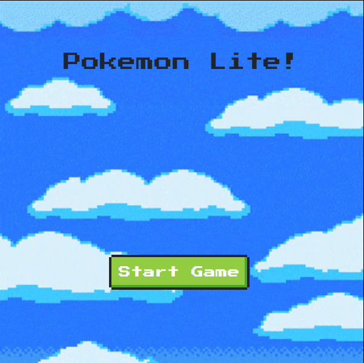
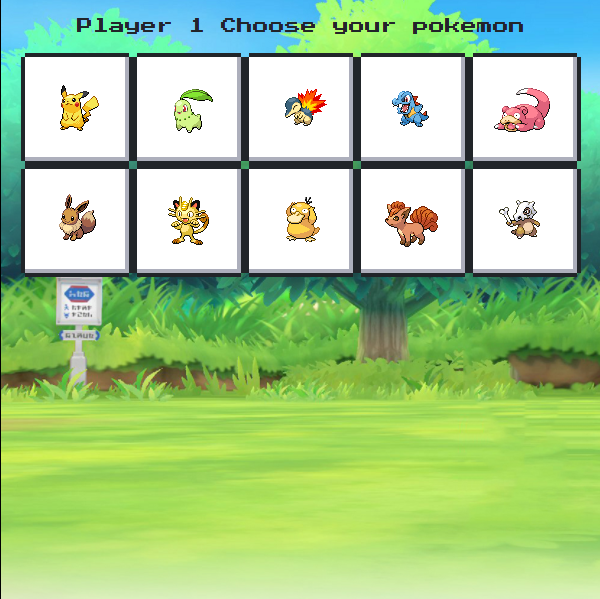
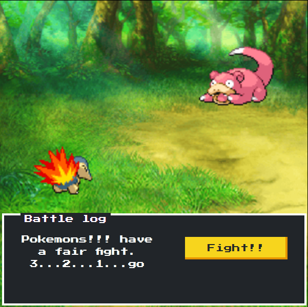
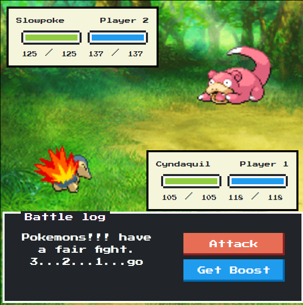
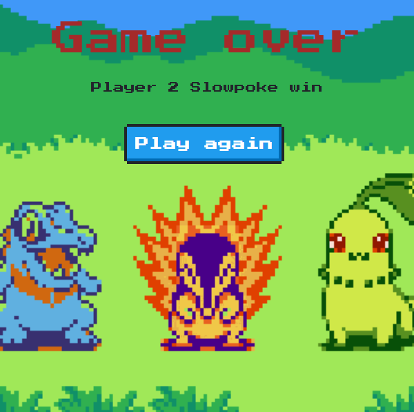

# Pokemon Lite

A project request from DCI to complete at the end of Programming basics after learning javascript!

The outcome was created from a group project and the collaborators are included in this repository.

Below you can check some screenshots of the Game.

### Start Game

### Players Select Pokemon

### Screen after picking pokemons and starting the fight

### Screen while fighting

### Screen on Game Over

